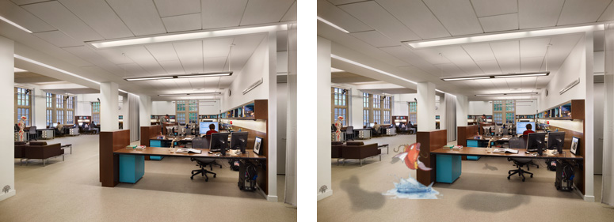
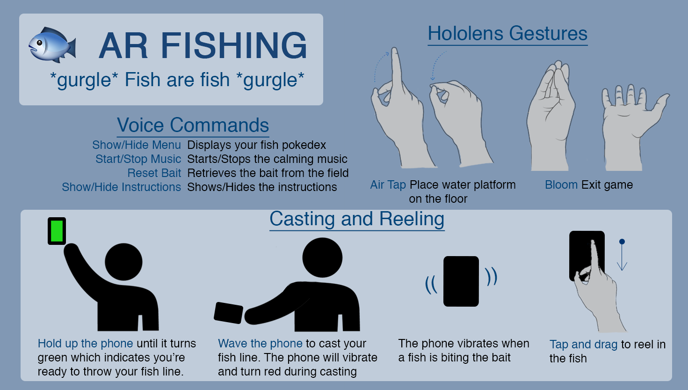

# AR Fishing
## User Guide

### Premise
Desk workers in offices and labs need breaks, and what could be more relaxing than fishing? Unfortunately, fishing at your desk is often either impractical, in the case of traditional “fishing,” or non immersive, in the case of “virtual” fishing through computer games. 🐟: AR Fishing seeks to resolve these problems using Augmented Reality in the form of the Microsoft Hololens.

<small>SIG lab without and with augmented reality fishing</small>

🐟: AR Fishing transforms any desk worker’s surroundings into an ecosystem filled with exotic aquatic life, just waiting to be either captured and cataloged, or serenely observed.

### Controls
When the program starts, air tap to enter the game and then air tap again to place the water platform. The fish will then start to spawn so you should walk around your space and check them out! Once you want to catch fish, hold the phone up until it is green and then cast a lure with a wave of the phone. Once a fish bites the lure the phone vibrates and then you can swipe continuously to reel in the fish. If the bait leaves the field, used voice commands (“reset bait”) to retrieve the bait.

### Setup
#### Required Hardware and Software
- Hololens and all the software required for it
- Android Phone
- Unity Hololens Technical Preview
- Unity 5.4 with Android SDK
- Windows 10 or later. Pro required for Hololens Emulator
- Visual Studios 2015

#### Instructions
1. Download Android App from [AR Fishing Mobile Controller](https://github.com/likangning93/ARFishing_mobileController) 
2. Download Hololens App from [AR Fishing](https://github.com/eldu/ARFishing)
3. Open Unity Hololens Technical Preview
Export from Unity to Visual Studio as shown in chapter 4 of the following [tutorial](https://developer.microsoft.com/en-us/windows/holographic/holograms_100).
4. Open the app In Visual Studio
    - Set to release, x86, and then run on Emulator, Device, or Remote Device
    - Note: if you run on the device, you will also need that IP address of the hololens which can be found in Setting > Internet / Network Settings > Advanced Options
5. Now since the app been deployed onto the Hololens you can now open it natively on the hololens.
6. Build the Android app using standard Unity - the Hololens technical preview does not seem to support integration with the Android SDK.

### Major Gameplay Features
- Physical mobility to take the game into any room and start fishing
- Various fish behaviors: Wander idle behavior and attraction to lure behavior when it is in their field of view and closeby
- Visibility-based lure response for the fish
- Voice commands to show/hide menus, start/stop music, reset bait, and show/hide instructions
- Gaze following behavior for menus
- Networked with an Android phone
    - accelerometer to determine casting of a fish line with a lure into the scene.
    - Haptic feedback on phone (vibration) during casting and when a fish bites the bait, when a fish escapes
    - Swipe-based fish reeling
- Used innate Hololens gestures (Air Tap) to place the water level
- Simulated real-world objects occluding fish using a specialized shader
- Calming background music

### Technical Issues
- Long building times (Build in Unity, build and deploy from Visual Studio)
- Debugging through the Hololens Emulator took a long time and also didn't always accurately depict what would happen on the Hololens. Instead we found it easier to simply debug in the Unity environment for the most part unless there was something Hololens specific.
- Documentation on the Hololens is still quite general and unclear. Though the tutorials are quite helpful.
- Networking with Android phone and Hololens worked out fine after some testing, but was non-trivial.

### Software and Assets
- Software used:
    - Unity: Hololens Technical Preview based on Unity 5.5 Beta versions
    - Autodesk Maya 2016/2017
    - Adobe Photoshop
    - Gimp 2
- Off-the-shelf Assets:
    - [Rachel Hwang’s Koi Fish Texture
Humpback Whale, by janpec](https://www.assetstore.unity3d.com/en/#!/content/3547)
    - [Koi fish from CadNav.com](http://www.cadnav.com/3d-models/model-569.html)
    - [Photon Unity Networking plugin](https://www.assetstore.unity3d.com/en/#!/content/1786)
    - [Vibration for Android - for more granular haptics on Android](https://www.assetstore.unity3d.com/en/#!/content/16648)
    - [Person waving icon](http://yoursightmatters.com/wp-content/themes/ysm/operation-sight-kf/imgs/VolunteerTransparent.png)
    - [Hololens gesture icons](https://support.microsoft.com/en-us/help/12644/hololens-use-gestures)
    - [Pokeball](http://www.turbosquid.com/3d-models/pok%C3%A9-ball-c4d-free/717151)
